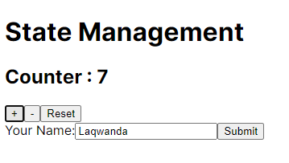
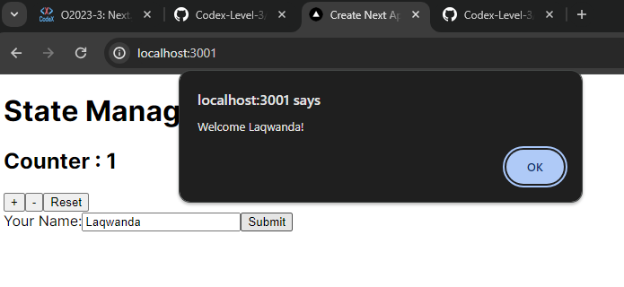

# React State Management

## Objective

The purpose of this assignment is to deepen your understanding of state management in React using the useState hook. You will build two components: a counter that can increase, decrease, and reset its value, and a form that captures user input in a controlled manner. This exercise will reinforce the concepts of stateful logic in functional components and demonstrate the power of React's reactivity system.

## Project Overview

This project includes the following components:

### Counter Component

- Counter.jsx : Implemented a counter with buttons to increase, decrease, and reset its value.

### User Form Component

- UserForm.jsx : A form with a single text input for the user's name and a submit button. It implemented controlled component logic using the `useState` hook to manage input field state. An Alert displays the input value upon form submission.

### Results

Counter  
  
Form Submission  


This is a [Next.js](https://nextjs.org/) project bootstrapped with [`create-next-app`](https://github.com/vercel/next.js/tree/canary/packages/create-next-app).

## Getting Started

First, run the development server:

```bash
npm run dev
# or
yarn dev
# or
pnpm dev
# or
bun dev
```

Open [http://localhost:3000](http://localhost:3000) with your browser to see the result.

You can start editing the page by modifying `app/page.js`. The page auto-updates as you edit the file.
